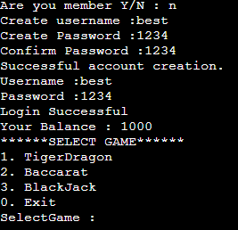
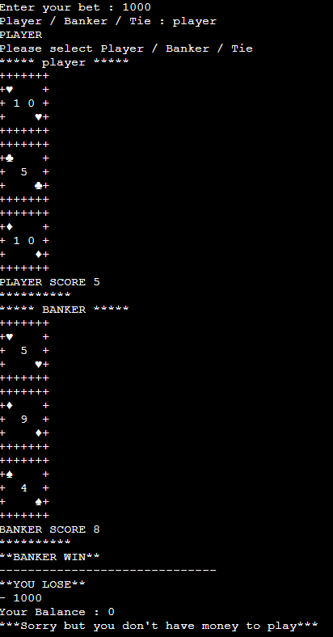
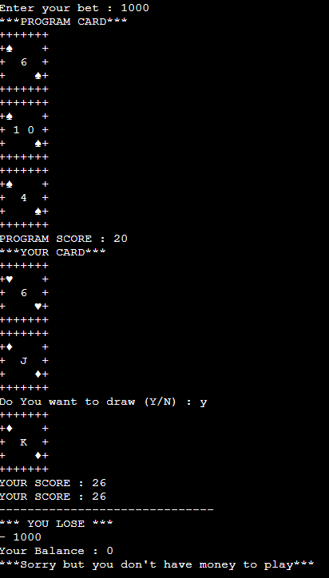

# Python
### ตัวอย่าง code login และ signin :
<details>
    <summary>รายละเอียดเพิ่มเติม</summary>
    
```python
    def login():
    while True:
        try:
            name=input('Username :')
            password=int(input('Password :'))
            if name in users:
                while users[name]!=password:
                    password=int(input('Password :'))
                print('Login Successful')
                break
            else:
                i=0
                while i<=3:
                    i+=1
                    print('Member information not found.')
                    if i>3:
                        signin()
                        break
                    name=input('Username :')
                    if name in users:
                        while users[name]!=password:
                            password=int(input('Password :'))
                        print('Login Successful.')
                        break
            break
                    
        except:
            print('Please enter password to number only.')

    def signin():
        createID=input('Create username :')
        if createID in users:
            print('ID online.')
        else:
            while True:
                try:
                    createpassword=int(input('Create Password :'))
                    confirm=int(input('Confirm Password :'))
                    while confirm!=createpassword:
                        print('Password do not match.')
                        createpassword=int(input('Create Password :'))
                        confirm=int(input('Confirm Password :'))
                    break
                except:
                    print('Please set password to number only.')
            users[createID]=createpassword
            print('Successful account creation.')
            login()
```
<center></center>
</details>

### ตัวอย่าง code เกมบาคาร่า :
<details>
    <summary>รายละเอียดเพิ่มเติม</summary>
    
```python
def bcbanker () :
    sumscore = 0

    print ("***** BANKER *****")
    
    bankercard1 = random.randint(1,13)
    card = bankercard1
    checkcard(card)
    if bankercard1 >= 10 :
        bankercard1 = 0

    bankercard2 = random.randint(1,13)
    card = bankercard2
    checkcard(card)
    if bankercard2 >= 10 :
        bankercard2 = 0
    
    sumscore = (bankercard1 + bankercard2)%10

    if sumscore == 8 :
        print("*** POK 8!!! ****")
        return sumscore
    elif sumscore == 9 :
        print("*** POK 9!!! ****")
        return sumscore


    if sumscore <= 5 :
        bankercard3 = random.randint(1,13)
        card = bankercard3
        checkcard(card)
        if bankercard3 >= 10 :
            bankercard3 = 0
        sumscore = (sumscore + bankercard3)%10
        return sumscore
    elif sumscore > 5 and sumscore < 8 :
        return sumscore
    else :
        return sumscore
```
<center></center>
</details>

### ตัวอย่าง code เกมแบล็คแจ็ค :
<details>
    <summary>รายละเอียดเพิ่มเติม</summary>
    
```python

def Blackjack2() :
    sumscore = 0
    
    score1 = random.randint(1,13)
    card = score1
    checkcard(card)
    if score1 >= 10 :
        score1 = 10

    score2 = random.randint(1,13)
    card = score2
    checkcard(card)
    if score2 >= 10 :
        score2 = 10
    
    sumscore = score1 + score2
    
    if score1 == 1 and score2 == 10 :
        sumscore = 21
    elif score2 == 1 and score1 == 10 :
        sumscore = 21

    if sumscore == 21 :
        print("PROGRAM SCORE :",sumscore)
        return sumscore     
        
    while True :
        score3 = random.randint(1,13)
        card = score3
        checkcard(card)
        if score3 >= 10 :
            score3 = 10
        sumscore = sumscore + score3
        if sumscore >= 17 :
            print("PROGRAM SCORE :",sumscore)
            return sumscore
        if sumscore > 21 :
            print("PROGRAM SCORE :",sumscore)
            return sumscore
```
<center></center>
</details>

### ตัวอย่าง code เกมแบล็คแจ็ค :
<details>
    <summary>รายละเอียดเพิ่มเติม</summary>
    
```python

def TigerDragon(money,) : 
    print("-"*30)

    while True :
        try :
            bet = int(input("Enter your bet : "))
            break
        except :
            print ("Please enter amount")

    if bet > money :
        bet = money

    money = money-bet

    while True :
        while True :
            while True :
                try :
                    TD = str(input("Tiger / DRAGON / Tie : "))
                    TD = TD.upper()
                    print (TD)
                    if TD != "Tiger" or "DRAGON" or "TIE" :
                        print ("Please select Tiger / DRAGON / Tie")
                    if TD == "TIGER" :
                        break
                    if TD == "DRAGON" :
                        break
                    if TD == "TIE" :
                        break
                except :
                    print ("Please select Tiger / DRAGON / Tie")

            TD = TD.upper()

            print("****TIGER****")
            numbertiger = random.randint(1,13)
            card = numbertiger
            checkcard(card)
            print("***TIGER SCORE :",card,"***")
            
            print("****DRAGON****")
            numberdragon = random.randint(1,13)
            card = numberdragon
            checkcard(card)
            print("***DRAGON SCORE :",card,"***")
            
            print("-"*30)

            if numberdragon == numbertiger and TD == "TIE":
                money = money+(bet*8)
                print("**YOU WIN**")
                print("+",bet*7)
            elif numberdragon > numbertiger and TD == "DRAGON":
                money = money+(bet*2)
                print("**YOU WIN**")
                print("+",bet*1)
            elif numberdragon < numbertiger and TD == "TIGER":
                money = money+(bet*2)
                print("**YOU WIN**")
                print("+",bet*1)
            else :
                print("**YOU LOSE**")
                print("-",bet)
            return money
```
<center></center>
</details>


